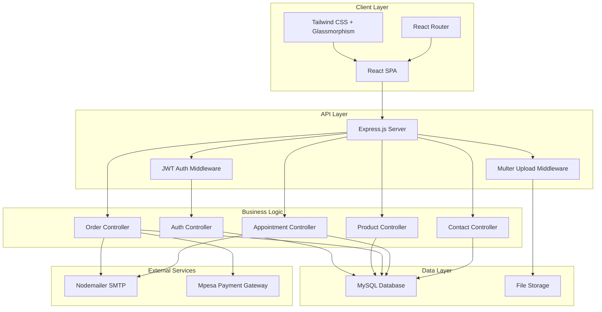
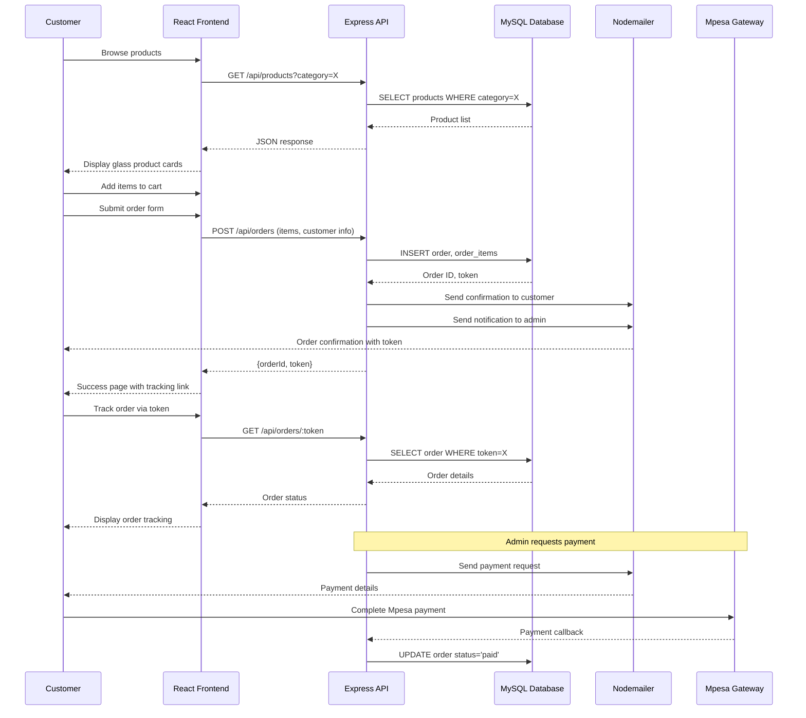
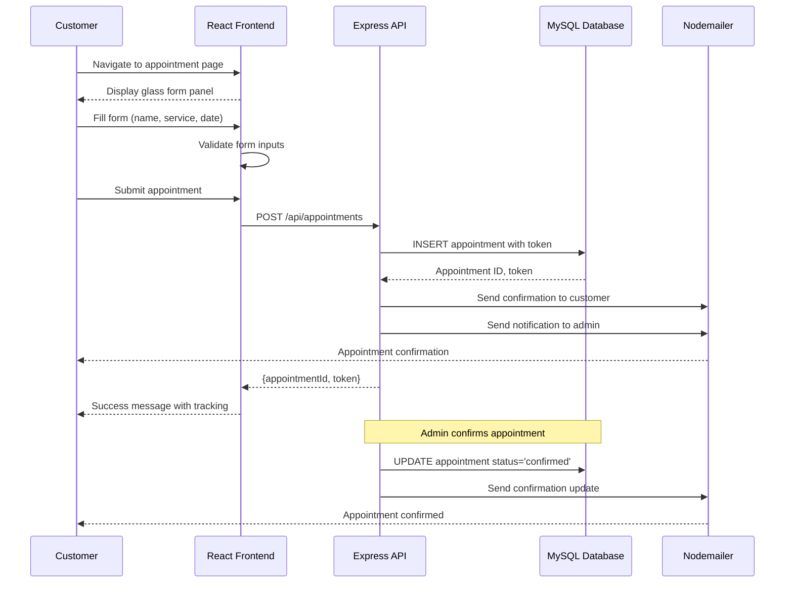
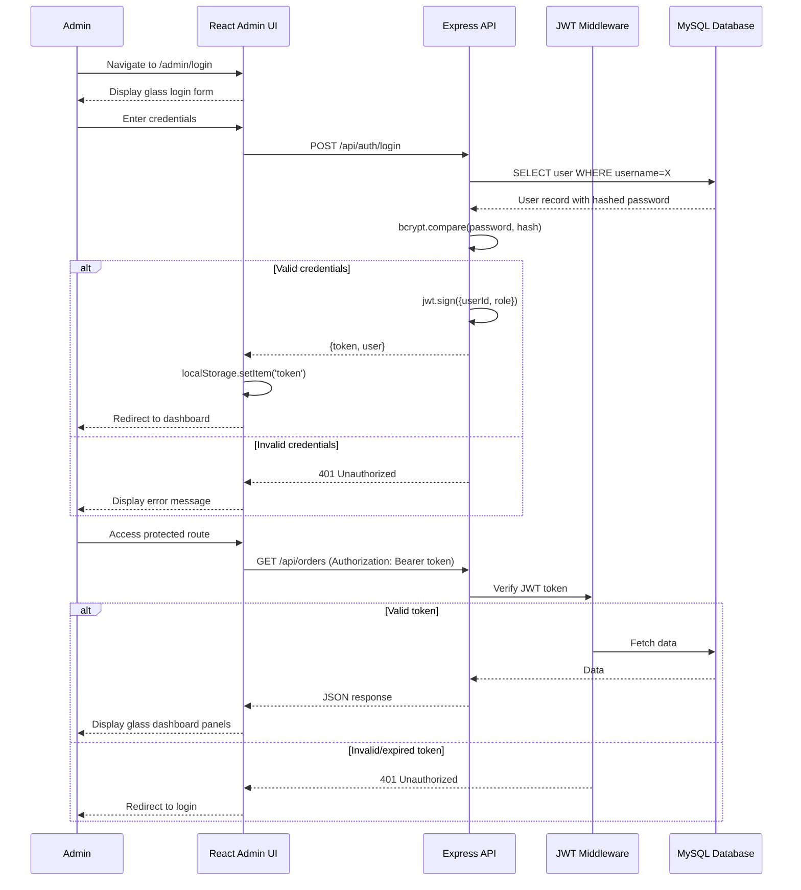

# Design Document: Esena Pharmacy Glassmorphism UI

## Overview

The Esena Pharmacy Glassmorphism UI is a comprehensive responsive web application featuring a modern frosted glass aesthetic. The system provides a full-stack e-commerce and appointment booking platform for a pharmacy business, with customer-facing pages for browsing products, placing orders, booking appointments, and an admin dashboard for managing inventory, orders, and appointments. The design emphasizes visual appeal through glassmorphism effects while maintaining accessibility and performance across mobile, tablet, and desktop devices.

The architecture follows a client-server model with a React frontend utilizing Tailwind CSS for glassmorphism styling, and an Express.js backend with MySQL database. The system implements token-based order and appointment tracking, email notifications, JWT authentication for admin access, and responsive layouts optimized for three breakpoint ranges.

## Architecture



## Sequence Diagrams

### Customer Order Flow



### Appointment Booking Flow



### Admin Dashboard Authentication Flow



## Components and Interfaces

### Frontend Component: GlassCard

**Purpose**: Reusable glassmorphism card component for consistent frosted glass aesthetic across all pages

**Interface**:
```typescript
interface GlassCardProps {
  children: React.ReactNode
  className?: string
  blur?: 'sm' | 'md' | 'lg'
  opacity?: number
  hover?: boolean
  onClick?: () => void
}

const GlassCard: React.FC<GlassCardProps>
```

**Responsibilities**:
- Apply glassmorphism styling (backdrop-blur, semi-transparent background, border)
- Support customizable blur intensity and opacity levels
- Provide hover effects when interactive
- Maintain responsive behavior across breakpoints


### Frontend Component: Header

**Purpose**: Responsive navigation header with glassmorphism styling

**Interface**:
```typescript
interface HeaderProps {
  transparent?: boolean
  fixed?: boolean
}

const Header: React.FC<HeaderProps>
```

**Responsibilities**:
- Display logo and navigation links
- Implement mobile hamburger menu for screens < 768px
- Show cart icon with item count badge
- Apply glass effect with backdrop blur
- Handle scroll-based transparency changes
- Provide WhatsApp floating button integration

### Frontend Component: ProductCard

**Purpose**: Display individual product with glassmorphism styling

**Interface**:
```typescript
interface Product {
  id: number
  name: string
  category: string
  price: number
  description: string
  image: string
  video?: string
  stock: number
}

interface ProductCardProps {
  product: Product
  onAddToCart: (product: Product) => void
  layout?: 'grid' | 'list'
}

const ProductCard: React.FC<ProductCardProps>
```

**Responsibilities**:
- Display product image, name, price, stock status
- Show "Add to Cart" button with glass styling
- Support grid and list layout modes
- Handle responsive image sizing
- Display stock availability indicators


### Frontend Component: AppointmentForm

**Purpose**: Glass panel form for booking appointments

**Interface**:
```typescript
interface AppointmentFormData {
  name: string
  email: string
  phone: string
  service: 'Dermatology' | 'LabTest' | 'Pharmacist'
  date: string
  message?: string
}

interface AppointmentFormProps {
  onSubmit: (data: AppointmentFormData) => Promise<void>
  loading?: boolean
}

const AppointmentForm: React.FC<AppointmentFormProps>
```

**Responsibilities**:
- Render form fields with glass input styling
- Validate form inputs (required fields, email format, phone format, future dates)
- Display loading state during submission
- Show success/error messages
- Reset form after successful submission

### Frontend Component: AdminSidebar

**Purpose**: Collapsible sidebar navigation for admin dashboard

**Interface**:
```typescript
interface AdminSidebarProps {
  activeRoute: string
  collapsed: boolean
  onToggle: () => void
}

const AdminSidebar: React.FC<AdminSidebarProps>
```

**Responsibilities**:
- Display navigation menu with icons
- Highlight active route
- Support collapse/expand on mobile
- Apply glassmorphism to sidebar panel
- Show user role and logout button


### Backend API: Product Controller

**Purpose**: Handle CRUD operations for products

**Interface**:
```typescript
interface ProductController {
  getAllProducts(req: Request, res: Response): Promise<void>
  getProductById(req: Request, res: Response): Promise<void>
  createProduct(req: Request, res: Response): Promise<void>
  updateProduct(req: Request, res: Response): Promise<void>
  deleteProduct(req: Request, res: Response): Promise<void>
}
```

**Responsibilities**:
- Query products with optional category filtering
- Handle file uploads for product images and videos
- Validate product data (name, price, stock)
- Update stock levels
- Return JSON responses with appropriate status codes

### Backend API: Order Controller

**Purpose**: Manage order lifecycle and token-based tracking

**Interface**:
```typescript
interface OrderController {
  createOrder(req: Request, res: Response): Promise<void>
  getOrderByToken(req: Request, res: Response): Promise<void>
  getAllOrders(req: Request, res: Response): Promise<void>
  updateOrderStatus(req: Request, res: Response): Promise<void>
}
```

**Responsibilities**:
- Create orders with unique tokens
- Calculate order totals from line items
- Send email notifications to customer and admin
- Retrieve order details by token for tracking
- Update order status through workflow stages
- Handle payment integration callbacks


### Backend Middleware: JWT Authentication

**Purpose**: Protect admin routes with token verification

**Interface**:
```typescript
interface AuthMiddleware {
  verifyToken(req: Request, res: Response, next: NextFunction): void
}

interface JWTPayload {
  userId: number
  role: 'admin' | 'doctor'
  iat: number
  exp: number
}
```

**Responsibilities**:
- Extract JWT token from Authorization header
- Verify token signature and expiration
- Decode payload and attach user info to request
- Return 401 for invalid/expired tokens
- Allow request to proceed for valid tokens

### Backend Middleware: File Upload

**Purpose**: Handle multipart form data for product images and videos

**Interface**:
```typescript
interface UploadMiddleware {
  fields: MulterField[]
  fileFilter: (req: Request, file: MulterFile, cb: FileFilterCallback) => void
  limits: { fileSize: number }
}
```

**Responsibilities**:
- Accept image files (jpg, png, webp) up to 5MB
- Accept video files (mp4, webm) up to 50MB
- Store files in /uploads directory with unique names
- Validate file types and sizes
- Return error for invalid uploads


## Data Models

### Model: User

```typescript
interface User {
  id: number
  username: string
  password: string  // bcrypt hashed
  role: 'admin' | 'doctor'
  created_at: Date
}
```

**Validation Rules**:
- username: 3-50 characters, alphanumeric, unique
- password: minimum 8 characters, hashed with bcrypt (salt rounds: 10)
- role: must be 'admin' or 'doctor'

### Model: Product

```typescript
interface Product {
  id: number
  name: string
  category: 'Prescription' | 'OTC' | 'Chronic' | 'Supplements' | 'PersonalCare'
  price: number
  description: string
  image: string
  video?: string
  stock: number
  created_at: Date
}
```

**Validation Rules**:
- name: 1-255 characters, required
- category: must be one of enum values
- price: positive decimal, max 10 digits with 2 decimal places
- stock: non-negative integer
- image: valid file path or URL
- video: optional, valid file path or URL


### Model: Order

```typescript
interface Order {
  id: number
  customer_name: string
  email: string
  phone: string
  delivery_address: string
  notes?: string
  total: number
  token: string
  status: 'pending' | 'payment_requested' | 'paid' | 'dispatched' | 'completed'
  created_at: Date
}
```

**Validation Rules**:
- customer_name: 1-255 characters, required
- email: valid email format, required
- phone: 10-20 characters, required
- delivery_address: required
- total: positive decimal, calculated from order items
- token: 50 characters, unique, auto-generated
- status: must be one of enum values, defaults to 'pending'

### Model: OrderItem

```typescript
interface OrderItem {
  id: number
  order_id: number
  product_id: number
  quantity: number
  price: number
}
```

**Validation Rules**:
- order_id: must reference valid order
- product_id: must reference valid product
- quantity: positive integer
- price: positive decimal, snapshot of product price at order time


### Model: Appointment

```typescript
interface Appointment {
  id: number
  name: string
  email: string
  phone: string
  service: 'Dermatology' | 'LabTest' | 'Pharmacist'
  date: Date
  message?: string
  token: string
  status: 'pending' | 'confirmed' | 'completed'
  created_at: Date
}
```

**Validation Rules**:
- name: 1-255 characters, required
- email: valid email format, required
- phone: 10-20 characters, required
- service: must be one of enum values
- date: must be future date, required
- token: 50 characters, unique, auto-generated
- status: must be one of enum values, defaults to 'pending'

### Model: Contact

```typescript
interface Contact {
  id: number
  name: string
  email: string
  phone: string
  message: string
  created_at: Date
}
```

**Validation Rules**:
- name: 1-255 characters, required
- email: valid email format, required
- phone: 10-20 characters, required
- message: required


## Algorithmic Pseudocode

### Main Glassmorphism Rendering Algorithm

```pascal
ALGORITHM renderGlassmorphismUI(component, props)
INPUT: component (React component), props (component properties)
OUTPUT: rendered DOM with glassmorphism effects

BEGIN
  ASSERT component IS valid React component
  ASSERT props.breakpoint IN ['mobile', 'tablet', 'desktop']
  
  // Step 1: Determine responsive layout
  layout ← calculateResponsiveLayout(props.breakpoint)
  
  // Step 2: Apply glassmorphism styles
  glassStyles ← {
    backdropFilter: 'blur(15px)',
    background: 'rgba(255, 255, 255, 0.1)',
    border: '1px solid rgba(255, 255, 255, 0.2)',
    borderRadius: layout.borderRadius,
    boxShadow: '0 8px 32px rgba(0, 0, 0, 0.1)'
  }
  
  // Step 3: Merge with component-specific styles
  finalStyles ← mergeStyles(glassStyles, props.customStyles)
  
  // Step 4: Render component with glass effect
  element ← createElement(component, {
    ...props,
    className: generateGlassClasses(finalStyles),
    style: finalStyles
  })
  
  ASSERT element IS valid DOM element
  ASSERT hasGlassmorphismEffect(element) = true
  
  RETURN element
END
```

**Preconditions**:
- component is a valid React component
- props.breakpoint is one of: 'mobile', 'tablet', 'desktop'
- Browser supports backdrop-filter CSS property

**Postconditions**:
- Returns valid DOM element with glassmorphism styling
- Element has backdrop-filter, semi-transparent background, and border
- Responsive layout is applied based on breakpoint

**Loop Invariants**: N/A (no loops in this algorithm)


### Responsive Layout Calculation Algorithm

```pascal
ALGORITHM calculateResponsiveLayout(breakpoint)
INPUT: breakpoint (string: 'mobile', 'tablet', 'desktop')
OUTPUT: layout configuration object

BEGIN
  ASSERT breakpoint IN ['mobile', 'tablet', 'desktop']
  
  IF breakpoint = 'mobile' THEN
    layout ← {
      columns: 1,
      padding: '16px',
      fontSize: '14px',
      borderRadius: '12px',
      headerHeight: '60px',
      sidebarCollapsed: true,
      gridGap: '12px'
    }
  ELSE IF breakpoint = 'tablet' THEN
    layout ← {
      columns: 2,
      padding: '24px',
      fontSize: '16px',
      borderRadius: '16px',
      headerHeight: '70px',
      sidebarCollapsed: false,
      gridGap: '16px'
    }
  ELSE
    layout ← {
      columns: 3,
      padding: '32px',
      fontSize: '16px',
      borderRadius: '20px',
      headerHeight: '80px',
      sidebarCollapsed: false,
      gridGap: '24px'
    }
  END IF
  
  ASSERT layout.columns > 0
  ASSERT layout.padding IS valid CSS value
  
  RETURN layout
END
```

**Preconditions**:
- breakpoint is one of: 'mobile', 'tablet', 'desktop'

**Postconditions**:
- Returns valid layout configuration object
- All layout properties have valid CSS values
- columns is positive integer


### Order Processing with Token Generation Algorithm

```pascal
ALGORITHM processOrder(orderData, items)
INPUT: orderData (customer information), items (array of cart items)
OUTPUT: order object with unique token

BEGIN
  ASSERT orderData.customer_name ≠ ∅
  ASSERT orderData.email IS valid email format
  ASSERT items.length > 0
  ASSERT ∀ item ∈ items: item.quantity > 0 AND item.price > 0
  
  // Step 1: Calculate order total
  total ← 0
  FOR each item IN items DO
    ASSERT item.quantity > 0 AND item.price ≥ 0
    total ← total + (item.price × item.quantity)
  END FOR
  
  ASSERT total > 0
  
  // Step 2: Generate unique token
  token ← generateUniqueToken()
  ASSERT token.length = 50
  ASSERT isUnique(token, 'orders') = true
  
  // Step 3: Create order record
  order ← {
    customer_name: orderData.customer_name,
    email: orderData.email,
    phone: orderData.phone,
    delivery_address: orderData.delivery_address,
    notes: orderData.notes,
    total: total,
    token: token,
    status: 'pending',
    created_at: currentTimestamp()
  }
  
  // Step 4: Insert into database
  orderId ← database.insert('orders', order)
  ASSERT orderId > 0
  
  // Step 5: Insert order items
  FOR each item IN items DO
    orderItem ← {
      order_id: orderId,
      product_id: item.product_id,
      quantity: item.quantity,
      price: item.price
    }
    database.insert('order_items', orderItem)
  END FOR
  
  // Step 6: Send notifications
  sendEmail(orderData.email, 'Order Confirmation', generateOrderEmail(order))
  sendEmail(ADMIN_EMAIL, 'New Order', generateAdminNotification(order))
  
  ASSERT order.id = orderId
  ASSERT order.token IS unique
  ASSERT order.status = 'pending'
  
  RETURN order
END
```

**Preconditions**:
- orderData contains valid customer information (name, email, phone, address)
- items array is non-empty
- All items have positive quantity and non-negative price
- Email service is configured and available

**Postconditions**:
- Order is created in database with unique ID
- Order has unique 50-character token
- Order total equals sum of (item.price × item.quantity) for all items
- All order items are inserted with correct order_id reference
- Confirmation emails sent to customer and admin
- Order status is 'pending'

**Loop Invariants**:
- During total calculation: total ≥ 0 for all iterations
- During item insertion: All previously inserted items have valid order_id


### Token Generation Algorithm

```pascal
ALGORITHM generateUniqueToken()
INPUT: none
OUTPUT: unique 50-character token string

BEGIN
  maxAttempts ← 10
  attempts ← 0
  
  WHILE attempts < maxAttempts DO
    ASSERT attempts < maxAttempts
    
    // Generate random token
    randomBytes ← generateCryptoRandomBytes(32)
    token ← base64Encode(randomBytes)
    token ← removeSpecialCharacters(token)
    token ← substring(token, 0, 50)
    
    ASSERT token.length = 50
    ASSERT token MATCHES /^[A-Za-z0-9]+$/
    
    // Check uniqueness in database
    IF NOT existsInDatabase('orders', 'token', token) AND
       NOT existsInDatabase('appointments', 'token', token) THEN
      RETURN token
    END IF
    
    attempts ← attempts + 1
  END WHILE
  
  // If all attempts failed, throw error
  THROW Error("Failed to generate unique token after " + maxAttempts + " attempts")
END
```

**Preconditions**:
- Crypto random number generator is available
- Database connection is active

**Postconditions**:
- Returns 50-character alphanumeric string
- Token is unique across orders and appointments tables
- Token contains only letters and numbers (no special characters)

**Loop Invariants**:
- attempts ≤ maxAttempts throughout loop execution
- Each generated token is 50 characters long
- Each generated token is alphanumeric


### JWT Authentication Verification Algorithm

```pascal
ALGORITHM verifyJWTToken(authHeader)
INPUT: authHeader (Authorization header string)
OUTPUT: decoded user payload or error

BEGIN
  ASSERT authHeader ≠ ∅
  
  // Step 1: Extract token from header
  IF NOT authHeader.startsWith('Bearer ') THEN
    THROW AuthError("Invalid authorization header format")
  END IF
  
  token ← authHeader.substring(7)
  ASSERT token.length > 0
  
  // Step 2: Verify token signature and expiration
  TRY
    payload ← jwt.verify(token, SECRET_KEY)
  CATCH error
    IF error.name = 'TokenExpiredError' THEN
      THROW AuthError("Token has expired")
    ELSE IF error.name = 'JsonWebTokenError' THEN
      THROW AuthError("Invalid token signature")
    ELSE
      THROW AuthError("Token verification failed")
    END IF
  END TRY
  
  // Step 3: Validate payload structure
  ASSERT payload.userId IS integer
  ASSERT payload.role IN ['admin', 'doctor']
  ASSERT payload.exp > currentTimestamp()
  
  // Step 4: Return decoded payload
  user ← {
    userId: payload.userId,
    role: payload.role,
    exp: payload.exp
  }
  
  ASSERT user.userId > 0
  ASSERT user.role IS valid
  
  RETURN user
END
```

**Preconditions**:
- authHeader is provided and non-empty
- SECRET_KEY is configured in environment
- JWT library is available

**Postconditions**:
- Returns valid user payload with userId and role
- Token signature is verified
- Token is not expired
- Throws AuthError for invalid/expired tokens

**Loop Invariants**: N/A (no loops)


### Product Filtering and Search Algorithm

```pascal
ALGORITHM filterProducts(products, filters, searchQuery)
INPUT: products (array of product objects), filters (filter criteria), searchQuery (search string)
OUTPUT: filtered array of products

BEGIN
  ASSERT products IS array
  
  filteredProducts ← []
  
  FOR each product IN products DO
    ASSERT allFilteredProductsValid(filteredProducts)
    
    matchesCategory ← true
    matchesSearch ← true
    matchesStock ← true
    
    // Apply category filter
    IF filters.category ≠ null THEN
      matchesCategory ← (product.category = filters.category)
    END IF
    
    // Apply search query
    IF searchQuery ≠ ∅ THEN
      searchLower ← toLowerCase(searchQuery)
      nameLower ← toLowerCase(product.name)
      descLower ← toLowerCase(product.description)
      matchesSearch ← (nameLower.contains(searchLower) OR 
                       descLower.contains(searchLower))
    END IF
    
    // Apply stock filter
    IF filters.inStockOnly = true THEN
      matchesStock ← (product.stock > 0)
    END IF
    
    // Add product if all criteria match
    IF matchesCategory AND matchesSearch AND matchesStock THEN
      filteredProducts.add(product)
    END IF
  END FOR
  
  ASSERT filteredProducts IS array
  ASSERT ∀ p ∈ filteredProducts: p IS valid product
  
  RETURN filteredProducts
END
```

**Preconditions**:
- products is a valid array (may be empty)
- filters object contains valid filter criteria
- searchQuery is a string (may be empty)

**Postconditions**:
- Returns array of products matching all filter criteria
- All returned products match category filter (if specified)
- All returned products match search query (if specified)
- All returned products have stock > 0 (if inStockOnly is true)
- Original products array is not modified

**Loop Invariants**:
- All products in filteredProducts meet all filter criteria
- filteredProducts contains only valid product objects


## Key Functions with Formal Specifications

### Function: createGlassCard()

```typescript
function createGlassCard(
  content: React.ReactNode,
  options: GlassCardOptions
): React.ReactElement
```

**Preconditions**:
- content is valid React node (element, string, number, or fragment)
- options.blur is one of: 'sm', 'md', 'lg', or undefined
- options.opacity is between 0 and 1, or undefined
- options.className is valid CSS class string, or undefined

**Postconditions**:
- Returns valid React element with glassmorphism styling
- Element has backdrop-filter CSS property applied
- Element has semi-transparent background with specified opacity
- Element has rounded corners and subtle border
- Element includes all content passed as children
- If options.hover is true, element has hover transition effects

**Loop Invariants**: N/A

### Function: validateOrderForm()

```typescript
function validateOrderForm(formData: OrderFormData): ValidationResult
```

**Preconditions**:
- formData is an object with customer_name, email, phone, delivery_address fields
- formData may contain optional notes field

**Postconditions**:
- Returns ValidationResult object with isValid boolean and errors array
- isValid is true if and only if all validation rules pass
- customer_name is non-empty string (1-255 characters)
- email matches valid email regex pattern
- phone is 10-20 characters
- delivery_address is non-empty string
- errors array contains descriptive messages for each failed validation
- If isValid is true, errors array is empty

**Loop Invariants**: N/A


### Function: calculateCartTotal()

```typescript
function calculateCartTotal(cartItems: CartItem[]): number
```

**Preconditions**:
- cartItems is an array (may be empty)
- All items in cartItems have quantity > 0
- All items in cartItems have price ≥ 0

**Postconditions**:
- Returns non-negative number representing total cost
- Total equals sum of (item.price × item.quantity) for all items
- If cartItems is empty, returns 0
- Result is rounded to 2 decimal places

**Loop Invariants**:
- Running total is non-negative throughout iteration
- Each processed item contributes (price × quantity) to total

### Function: sendOrderConfirmationEmail()

```typescript
function sendOrderConfirmationEmail(
  order: Order,
  recipient: string
): Promise<void>
```

**Preconditions**:
- order is valid Order object with all required fields
- order.token is unique 50-character string
- recipient is valid email address
- Email service (Nodemailer) is configured with valid SMTP credentials
- FRONTEND_URL environment variable is set

**Postconditions**:
- Email is sent to recipient address
- Email contains order details (customer name, token, total)
- Email includes tracking link: {FRONTEND_URL}/track/{token}
- Promise resolves on successful send
- Promise rejects with error on failure
- No side effects on order object

**Loop Invariants**: N/A


### Function: updateOrderStatus()

```typescript
function updateOrderStatus(
  orderId: number,
  newStatus: OrderStatus
): Promise<void>
```

**Preconditions**:
- orderId is positive integer
- orderId references existing order in database
- newStatus is one of: 'pending', 'payment_requested', 'paid', 'dispatched', 'completed'
- Database connection is active

**Postconditions**:
- Order status is updated in database
- Status transition follows valid workflow:
  - pending → payment_requested → paid → dispatched → completed
- Email notification sent to customer if status is 'payment_requested', 'dispatched', or 'completed'
- Promise resolves on successful update
- Promise rejects if order not found or database error
- Order's updated_at timestamp is modified

**Loop Invariants**: N/A

### Function: applyResponsiveBreakpoint()

```typescript
function applyResponsiveBreakpoint(windowWidth: number): Breakpoint
```

**Preconditions**:
- windowWidth is non-negative number representing pixels

**Postconditions**:
- Returns 'mobile' if windowWidth < 768
- Returns 'tablet' if 768 ≤ windowWidth ≤ 1024
- Returns 'desktop' if windowWidth > 1024
- Return value is always one of: 'mobile', 'tablet', 'desktop'

**Loop Invariants**: N/A


## Example Usage

### Example 1: Creating a Glass Card Component

```typescript
// Basic glass card usage
import GlassCard from './components/GlassCard'

function ProductDisplay() {
  return (
    <GlassCard blur="md" opacity={0.15} hover={true}>
      <h3>Product Name</h3>
      <p>Product description goes here</p>
      <button>Add to Cart</button>
    </GlassCard>
  )
}

// Custom styling with Tailwind
function HeroSection() {
  return (
    <GlassCard 
      className="p-8 md:p-12 lg:p-16"
      blur="lg"
      opacity={0.1}
    >
      <h1 className="text-3xl md:text-5xl font-bold text-white">
        Welcome to Esena Pharmacy
      </h1>
      <p className="text-lg text-white/90 mt-4">
        Your trusted healthcare partner
      </p>
    </GlassCard>
  )
}
```

### Example 2: Responsive Product Grid

```typescript
import { useState, useEffect } from 'react'
import ProductCard from './components/ProductCard'
import { applyResponsiveBreakpoint } from './utils/responsive'

function ProductGrid() {
  const [breakpoint, setBreakpoint] = useState('desktop')
  const [products, setProducts] = useState([])
  
  useEffect(() => {
    const handleResize = () => {
      setBreakpoint(applyResponsiveBreakpoint(window.innerWidth))
    }
    
    window.addEventListener('resize', handleResize)
    handleResize()
    
    return () => window.removeEventListener('resize', handleResize)
  }, [])
  
  const gridColumns = {
    mobile: 'grid-cols-1',
    tablet: 'grid-cols-2',
    desktop: 'grid-cols-3'
  }
  
  return (
    <div className={`grid ${gridColumns[breakpoint]} gap-6`}>
      {products.map(product => (
        <ProductCard 
          key={product.id}
          product={product}
          onAddToCart={handleAddToCart}
        />
      ))}
    </div>
  )
}
```


### Example 3: Order Submission Flow

```typescript
import { useState } from 'react'
import { validateOrderForm } from './utils/validation'
import { createOrder } from './api/orders'

function CheckoutPage() {
  const [formData, setFormData] = useState({
    customer_name: '',
    email: '',
    phone: '',
    delivery_address: '',
    notes: ''
  })
  const [cartItems, setCartItems] = useState([])
  const [loading, setLoading] = useState(false)
  
  const handleSubmit = async (e) => {
    e.preventDefault()
    
    // Validate form
    const validation = validateOrderForm(formData)
    if (!validation.isValid) {
      alert(validation.errors.join('\n'))
      return
    }
    
    // Validate cart
    if (cartItems.length === 0) {
      alert('Cart is empty')
      return
    }
    
    setLoading(true)
    
    try {
      // Create order
      const result = await createOrder({
        ...formData,
        items: cartItems
      })
      
      // Redirect to tracking page
      window.location.href = `/track/${result.token}`
    } catch (error) {
      alert('Order failed: ' + error.message)
    } finally {
      setLoading(false)
    }
  }
  
  return (
    <GlassCard className="max-w-2xl mx-auto p-8">
      <form onSubmit={handleSubmit}>
        <input
          type="text"
          placeholder="Full Name"
          value={formData.customer_name}
          onChange={(e) => setFormData({...formData, customer_name: e.target.value})}
          className="glass-input"
        />
        {/* More form fields... */}
        <button 
          type="submit" 
          disabled={loading}
          className="glass-button"
        >
          {loading ? 'Processing...' : 'Place Order'}
        </button>
      </form>
    </GlassCard>
  )
}
```


### Example 4: Admin Dashboard with Protected Routes

```typescript
import { useEffect, useState } from 'react'
import { verifyJWTToken } from './utils/auth'
import AdminSidebar from './components/AdminSidebar'
import GlassCard from './components/GlassCard'

function AdminDashboard() {
  const [user, setUser] = useState(null)
  const [orders, setOrders] = useState([])
  const [sidebarCollapsed, setSidebarCollapsed] = useState(false)
  
  useEffect(() => {
    // Verify authentication
    const token = localStorage.getItem('token')
    if (!token) {
      window.location.href = '/admin/login'
      return
    }
    
    try {
      const decoded = verifyJWTToken(`Bearer ${token}`)
      setUser(decoded)
      fetchOrders(token)
    } catch (error) {
      localStorage.removeItem('token')
      window.location.href = '/admin/login'
    }
  }, [])
  
  const fetchOrders = async (token) => {
    const response = await fetch('/api/orders', {
      headers: {
        'Authorization': `Bearer ${token}`
      }
    })
    const data = await response.json()
    setOrders(data)
  }
  
  if (!user) return <div>Loading...</div>
  
  return (
    <div className="flex min-h-screen">
      <AdminSidebar 
        activeRoute="/admin/orders"
        collapsed={sidebarCollapsed}
        onToggle={() => setSidebarCollapsed(!sidebarCollapsed)}
      />
      
      <main className="flex-1 p-6">
        <GlassCard className="mb-6">
          <h1 className="text-2xl font-bold">Orders Dashboard</h1>
          <p>Welcome, {user.role}</p>
        </GlassCard>
        
        <div className="grid grid-cols-1 md:grid-cols-2 lg:grid-cols-3 gap-6">
          {orders.map(order => (
            <GlassCard key={order.id} hover={true}>
              <h3>{order.customer_name}</h3>
              <p>Status: {order.status}</p>
              <p>Total: ${order.total}</p>
            </GlassCard>
          ))}
        </div>
      </main>
    </div>
  )
}
```


### Example 5: Backend Order Processing

```javascript
// Backend: Order Controller
const db = require('../config/db')
const transporter = require('../config/mail')
const generateToken = require('../utils/tokenGenerator')

exports.createOrder = async (req, res) => {
  try {
    const { customer_name, email, phone, delivery_address, notes, items } = req.body
    
    // Validate inputs
    if (!customer_name || !email || !phone || !delivery_address) {
      return res.status(400).json({ message: 'Missing required fields' })
    }
    
    if (!items || items.length === 0) {
      return res.status(400).json({ message: 'Cart is empty' })
    }
    
    // Calculate total
    const total = items.reduce((sum, item) => {
      return sum + (item.price * item.quantity)
    }, 0)
    
    // Generate unique token
    const token = generateToken()
    
    // Insert order
    const [orderResult] = await db.query(
      `INSERT INTO orders 
       (customer_name, email, phone, delivery_address, notes, total, token, status) 
       VALUES (?, ?, ?, ?, ?, ?, ?, 'pending')`,
      [customer_name, email, phone, delivery_address, notes, total, token]
    )
    
    const orderId = orderResult.insertId
    
    // Insert order items
    for (const item of items) {
      await db.query(
        `INSERT INTO order_items (order_id, product_id, quantity, price) 
         VALUES (?, ?, ?, ?)`,
        [orderId, item.product_id, item.quantity, item.price]
      )
    }
    
    // Send emails
    await transporter.sendMail({
      from: process.env.EMAIL_USER,
      to: email,
      subject: 'Order Confirmation - Esena Pharmacy',
      html: `
        <h2>Thank you for your order, ${customer_name}!</h2>
        <p>Your order has been received and is being processed.</p>
        <p><strong>Order Token:</strong> ${token}</p>
        <p><strong>Total:</strong> $${total.toFixed(2)}</p>
        <p>Track your order: <a href="${process.env.FRONTEND_URL}/track/${token}">Click here</a></p>
      `
    })
    
    res.status(201).json({ 
      orderId, 
      token, 
      message: 'Order created successfully' 
    })
  } catch (error) {
    console.error('Order creation error:', error)
    res.status(500).json({ message: 'Server error', error: error.message })
  }
}
```


## Correctness Properties

### Universal Quantification Statements

**Property 1: Glassmorphism Consistency**
```
∀ component ∈ GlassComponents: 
  hasBackdropBlur(component) ∧ 
  hasSemiTransparentBackground(component) ∧ 
  hasBorder(component) ∧
  hasRoundedCorners(component)
```
All glassmorphism components must have backdrop blur, semi-transparent background, border, and rounded corners.

**Property 2: Token Uniqueness**
```
∀ order₁, order₂ ∈ Orders: 
  order₁.id ≠ order₂.id ⟹ order₁.token ≠ order₂.token

∀ appointment₁, appointment₂ ∈ Appointments: 
  appointment₁.id ≠ appointment₂.id ⟹ appointment₁.token ≠ appointment₂.token

∀ order ∈ Orders, appointment ∈ Appointments:
  order.token ≠ appointment.token
```
All tokens must be unique across orders and appointments.

**Property 3: Order Total Correctness**
```
∀ order ∈ Orders:
  order.total = Σ(item.price × item.quantity) for all item ∈ order.items
```
Order total must equal the sum of all line item subtotals.

**Property 4: Responsive Breakpoint Coverage**
```
∀ width ∈ ℕ:
  (width < 768 ⟹ breakpoint(width) = 'mobile') ∧
  (768 ≤ width ≤ 1024 ⟹ breakpoint(width) = 'tablet') ∧
  (width > 1024 ⟹ breakpoint(width) = 'desktop')
```
Every window width maps to exactly one breakpoint category.

**Property 5: Order Status Workflow**
```
∀ order ∈ Orders:
  validTransition(order.status, newStatus) ⟹
    newStatus ∈ {'pending', 'payment_requested', 'paid', 'dispatched', 'completed'} ∧
    (order.status = 'pending' ⟹ newStatus ∈ {'payment_requested', 'completed'}) ∧
    (order.status = 'payment_requested' ⟹ newStatus ∈ {'paid', 'completed'}) ∧
    (order.status = 'paid' ⟹ newStatus ∈ {'dispatched', 'completed'}) ∧
    (order.status = 'dispatched' ⟹ newStatus = 'completed')
```
Order status transitions must follow valid workflow progression.


**Property 6: Authentication Token Validity**
```
∀ request ∈ ProtectedRequests:
  hasValidToken(request) ⟺ 
    (request.headers.authorization.startsWith('Bearer ') ∧
     jwt.verify(extractToken(request), SECRET_KEY) ∧
     extractToken(request).exp > currentTimestamp())
```
Protected requests are valid if and only if they have a properly formatted, signed, and non-expired JWT token.

**Property 7: Email Notification Completeness**
```
∀ order ∈ Orders:
  order.created ⟹ 
    emailSent(order.email, 'confirmation') ∧ 
    emailSent(ADMIN_EMAIL, 'notification')

∀ appointment ∈ Appointments:
  appointment.created ⟹ 
    emailSent(appointment.email, 'confirmation') ∧ 
    emailSent(ADMIN_EMAIL, 'notification')
```
Every created order and appointment triggers confirmation email to customer and notification to admin.

**Property 8: Form Validation Completeness**
```
∀ formData ∈ OrderForms:
  isValid(formData) ⟺ 
    (formData.customer_name.length ∈ [1, 255] ∧
     isValidEmail(formData.email) ∧
     formData.phone.length ∈ [10, 20] ∧
     formData.delivery_address.length > 0)
```
Order form is valid if and only if all required fields meet their validation criteria.

**Property 9: Cart Item Validity**
```
∀ item ∈ CartItems:
  isValid(item) ⟹ 
    (item.quantity > 0 ∧ 
     item.price ≥ 0 ∧ 
     item.product_id ∈ Products.ids)
```
All cart items must have positive quantity, non-negative price, and reference existing products.

**Property 10: Responsive Layout Consistency**
```
∀ page ∈ Pages, breakpoint ∈ Breakpoints:
  layout(page, breakpoint).columns ∈ ℕ⁺ ∧
  layout(page, breakpoint).padding ∈ ValidCSSValues ∧
  layout(page, breakpoint).fontSize ∈ ValidCSSValues
```
All page layouts at all breakpoints have valid CSS property values.


## Error Handling

### Error Scenario 1: Invalid JWT Token

**Condition**: User attempts to access protected admin route with invalid, expired, or missing JWT token

**Response**: 
- Middleware returns 401 Unauthorized status
- Response body: `{ message: "Unauthorized: Invalid or expired token" }`
- Frontend redirects to `/admin/login`
- Token removed from localStorage

**Recovery**: 
- User must log in again with valid credentials
- New JWT token issued upon successful authentication
- User redirected to originally requested route

### Error Scenario 2: Order Creation Failure

**Condition**: Database error, email service failure, or validation error during order creation

**Response**:
- If validation error: Return 400 Bad Request with specific field errors
- If database error: Return 500 Internal Server Error
- If email error: Log error but complete order creation (return 201 with warning)
- Transaction rollback for database errors to prevent partial order creation

**Recovery**:
- Frontend displays error message to user
- User can retry order submission
- Admin notified of email failures via system logs
- Partial orders prevented through database transactions

### Error Scenario 3: Product Not Found

**Condition**: User attempts to view or add to cart a product that doesn't exist or has been deleted

**Response**:
- API returns 404 Not Found status
- Response body: `{ message: "Product not found" }`
- Frontend displays "Product unavailable" message
- Cart automatically removes invalid product references

**Recovery**:
- User redirected to product listing page
- Cart recalculated without invalid items
- User can continue shopping with valid products


### Error Scenario 4: File Upload Failure

**Condition**: Admin attempts to upload product image/video that exceeds size limit or has invalid file type

**Response**:
- Multer middleware rejects upload before reaching controller
- Return 400 Bad Request status
- Response body: `{ message: "Invalid file: [reason]" }`
- Reasons: "File too large", "Invalid file type", "No file provided"

**Recovery**:
- Frontend displays specific error message
- User can retry with valid file
- Form retains other field values
- File input cleared for new selection

### Error Scenario 5: Token Generation Collision

**Condition**: Generated token already exists in database (extremely rare)

**Response**:
- Token generation algorithm retries up to 10 times
- If all attempts fail: Return 500 Internal Server Error
- Response body: `{ message: "Failed to generate unique token" }`
- Error logged with timestamp and attempt count

**Recovery**:
- User prompted to retry order/appointment submission
- System administrator notified if collision rate increases
- Database indexes ensure fast uniqueness checks

### Error Scenario 6: Email Service Unavailable

**Condition**: SMTP server unreachable or authentication fails during email sending

**Response**:
- Order/appointment creation completes successfully
- Email error caught and logged
- Return 201 Created with warning flag
- Response body: `{ orderId, token, warning: "Email notification failed" }`

**Recovery**:
- Order/appointment data saved in database
- Admin can manually send confirmation emails
- System monitors email service health
- Retry mechanism for failed emails (background job)


### Error Scenario 7: Database Connection Loss

**Condition**: MySQL database becomes unavailable during request processing

**Response**:
- Database query throws connection error
- Controller catches error and returns 503 Service Unavailable
- Response body: `{ message: "Service temporarily unavailable" }`
- Error logged with stack trace

**Recovery**:
- Frontend displays "Service unavailable, please try again" message
- Automatic retry with exponential backoff
- Database connection pool attempts reconnection
- Health check endpoint monitors database status

### Error Scenario 8: Invalid Order Status Transition

**Condition**: Admin attempts to update order status to invalid state (e.g., 'paid' to 'pending')

**Response**:
- Validation logic rejects invalid transition
- Return 400 Bad Request status
- Response body: `{ message: "Invalid status transition from [current] to [new]" }`

**Recovery**:
- Frontend displays error message
- Order status remains unchanged
- Admin can select valid next status
- Status workflow diagram shown to admin

### Error Scenario 9: Responsive Layout Rendering Failure

**Condition**: Browser doesn't support backdrop-filter CSS property (older browsers)

**Response**:
- CSS fallback applied automatically
- Solid background color used instead of glassmorphism
- Layout and functionality remain intact
- Visual appearance degraded gracefully

**Recovery**:
- User sees functional interface with solid backgrounds
- Message displayed: "For best experience, use modern browser"
- All features remain accessible
- Progressive enhancement ensures core functionality


## Testing Strategy

### Unit Testing Approach

**Frontend Unit Tests** (Jest + React Testing Library):
- Test individual components in isolation (GlassCard, ProductCard, Header, Footer)
- Mock API calls and external dependencies
- Test component rendering with different props
- Test user interactions (clicks, form inputs, navigation)
- Test responsive behavior at different breakpoints
- Test form validation logic
- Test utility functions (calculateCartTotal, validateOrderForm, applyResponsiveBreakpoint)

**Key Test Cases**:
- GlassCard renders with correct glassmorphism styles
- ProductCard displays product information correctly
- Header navigation links work properly
- Form validation catches invalid inputs
- Cart total calculation is accurate
- Responsive breakpoint detection works for all width ranges

**Backend Unit Tests** (Jest/Mocha):
- Test controllers with mocked database and email service
- Test middleware (JWT verification, file upload validation)
- Test utility functions (token generation, email templates)
- Test database query construction
- Test error handling for various failure scenarios

**Key Test Cases**:
- Order creation with valid data succeeds
- Order creation with invalid data returns 400
- JWT verification rejects expired tokens
- Token generation produces unique 50-character strings
- File upload rejects oversized files
- Email service failures don't prevent order creation

**Coverage Goals**: Minimum 80% code coverage for both frontend and backend


### Property-Based Testing Approach

**Property Test Library**: fast-check (JavaScript/TypeScript)

**Property Tests for Core Algorithms**:

**Test 1: Token Uniqueness Property**
```typescript
import fc from 'fast-check'

test('generated tokens are always unique', () => {
  fc.assert(
    fc.property(fc.nat(1000), (iterations) => {
      const tokens = new Set()
      for (let i = 0; i < iterations; i++) {
        const token = generateToken()
        expect(tokens.has(token)).toBe(false)
        tokens.add(token)
      }
      return true
    })
  )
})
```

**Test 2: Order Total Calculation Property**
```typescript
test('order total equals sum of item subtotals', () => {
  fc.assert(
    fc.property(
      fc.array(
        fc.record({
          price: fc.float({ min: 0, max: 1000 }),
          quantity: fc.integer({ min: 1, max: 100 })
        }),
        { minLength: 1, maxLength: 20 }
      ),
      (items) => {
        const calculatedTotal = calculateCartTotal(items)
        const expectedTotal = items.reduce(
          (sum, item) => sum + item.price * item.quantity,
          0
        )
        expect(calculatedTotal).toBeCloseTo(expectedTotal, 2)
      }
    )
  )
})
```

**Test 3: Responsive Breakpoint Property**
```typescript
test('every width maps to exactly one breakpoint', () => {
  fc.assert(
    fc.property(fc.integer({ min: 0, max: 5000 }), (width) => {
      const breakpoint = applyResponsiveBreakpoint(width)
      expect(['mobile', 'tablet', 'desktop']).toContain(breakpoint)
      
      if (width < 768) expect(breakpoint).toBe('mobile')
      else if (width <= 1024) expect(breakpoint).toBe('tablet')
      else expect(breakpoint).toBe('desktop')
    })
  )
})
```

**Test 4: Form Validation Idempotency**
```typescript
test('validation result is consistent for same input', () => {
  fc.assert(
    fc.property(
      fc.record({
        customer_name: fc.string(),
        email: fc.emailAddress(),
        phone: fc.string(),
        delivery_address: fc.string()
      }),
      (formData) => {
        const result1 = validateOrderForm(formData)
        const result2 = validateOrderForm(formData)
        expect(result1).toEqual(result2)
      }
    )
  )
})
```


**Test 5: Glassmorphism Style Application Property**
```typescript
test('all glass components have required CSS properties', () => {
  fc.assert(
    fc.property(
      fc.record({
        blur: fc.constantFrom('sm', 'md', 'lg'),
        opacity: fc.float({ min: 0, max: 1 })
      }),
      (options) => {
        const element = createGlassCard(<div>Test</div>, options)
        const styles = element.props.style
        
        expect(styles.backdropFilter).toBeDefined()
        expect(styles.background).toMatch(/rgba\(\d+,\s*\d+,\s*\d+,\s*[\d.]+\)/)
        expect(styles.border).toBeDefined()
        expect(styles.borderRadius).toBeDefined()
      }
    )
  )
})
```

### Integration Testing Approach

**API Integration Tests** (Supertest + Jest):
- Test complete request/response cycles
- Use test database with seed data
- Test authentication flows end-to-end
- Test order creation with database persistence
- Test file upload with actual file system
- Test email sending with mock SMTP server

**Key Integration Test Scenarios**:
- Complete order flow: browse products → add to cart → checkout → receive confirmation
- Admin authentication: login → access protected routes → logout
- Appointment booking: fill form → submit → receive confirmation email
- Product management: create → update → delete with image uploads
- Order tracking: create order → track by token → update status

**Frontend Integration Tests** (Cypress):
- Test user journeys across multiple pages
- Test responsive behavior at different viewport sizes
- Test form submissions with API integration
- Test navigation and routing
- Test glassmorphism rendering in real browser

**Key E2E Test Scenarios**:
- Customer places order and tracks it
- Admin logs in and manages orders
- Mobile user browses products and books appointment
- Glassmorphism effects render correctly across browsers


## Performance Considerations

### Frontend Performance Optimization

**Glassmorphism Rendering**:
- Use CSS `will-change` property for animated glass elements
- Limit backdrop-blur usage to visible viewport (lazy rendering)
- Use CSS containment for isolated glass components
- Implement virtual scrolling for long product lists
- Optimize blur radius based on device capabilities

**Image Optimization**:
- Serve responsive images with srcset for different screen sizes
- Use WebP format with JPEG fallback
- Implement lazy loading for product images below fold
- Compress images to < 200KB for product cards
- Use placeholder blur-up technique during loading

**Code Splitting**:
- Split admin dashboard into separate bundle
- Lazy load route components with React.lazy()
- Separate vendor bundle from application code
- Load Tailwind CSS only for used classes (PurgeCSS)

**Performance Targets**:
- First Contentful Paint (FCP): < 1.5s
- Largest Contentful Paint (LCP): < 2.5s
- Time to Interactive (TTI): < 3.5s
- Cumulative Layout Shift (CLS): < 0.1

### Backend Performance Optimization

**Database Optimization**:
- Index on frequently queried columns (token, email, category, status)
- Use connection pooling (max 10 connections)
- Implement query result caching for product listings
- Use prepared statements to prevent SQL injection and improve performance
- Optimize JOIN queries for order items retrieval

**API Response Optimization**:
- Implement pagination for product and order listings (20 items per page)
- Use compression middleware (gzip) for JSON responses
- Cache static product data with Redis (5-minute TTL)
- Implement rate limiting (100 requests per minute per IP)

**File Upload Optimization**:
- Stream large files instead of buffering in memory
- Resize images on upload (max 1200px width)
- Generate thumbnails asynchronously
- Store files on CDN for faster delivery

**Performance Targets**:
- API response time: < 200ms for cached queries
- API response time: < 500ms for database queries
- File upload processing: < 2s for images, < 10s for videos


## Security Considerations

### Authentication & Authorization

**JWT Security**:
- Use strong secret key (minimum 256 bits, stored in environment variable)
- Set token expiration to 24 hours
- Implement token refresh mechanism
- Store tokens in httpOnly cookies (not localStorage) for production
- Validate token signature and expiration on every protected request

**Password Security**:
- Hash passwords with bcrypt (salt rounds: 10)
- Enforce minimum password length (8 characters)
- Implement password complexity requirements for production
- Never log or expose passwords in error messages
- Use HTTPS for all authentication requests

### Input Validation & Sanitization

**Frontend Validation**:
- Validate all form inputs before submission
- Sanitize user input to prevent XSS attacks
- Use Content Security Policy (CSP) headers
- Escape HTML in user-generated content

**Backend Validation**:
- Use express-validator for all API endpoints
- Validate data types, lengths, and formats
- Sanitize SQL inputs (use parameterized queries)
- Validate file uploads (type, size, content)
- Implement rate limiting to prevent abuse

### Data Protection

**Sensitive Data Handling**:
- Never store credit card information (use payment gateway)
- Encrypt sensitive data at rest (customer addresses, phone numbers)
- Use HTTPS/TLS for all data transmission
- Implement CORS with specific origin whitelist
- Log security events without exposing sensitive data

**Database Security**:
- Use least privilege principle for database user
- Separate database credentials for dev/staging/production
- Regular database backups (daily automated backups)
- Implement SQL injection prevention (parameterized queries)
- Encrypt database connection strings


### API Security

**Request Security**:
- Implement CSRF protection for state-changing operations
- Use helmet.js for security headers
- Implement rate limiting (100 requests/minute per IP)
- Validate Content-Type headers
- Implement request size limits (10MB max)

**File Upload Security**:
- Validate file types using magic numbers (not just extensions)
- Scan uploaded files for malware
- Store uploads outside web root
- Generate unique filenames to prevent overwrites
- Implement file size limits (5MB images, 50MB videos)

**Error Handling Security**:
- Never expose stack traces in production
- Use generic error messages for authentication failures
- Log detailed errors server-side only
- Implement error monitoring (Sentry or similar)
- Rate limit failed authentication attempts

### Compliance & Privacy

**Data Privacy**:
- Implement GDPR-compliant data handling
- Provide data export functionality for users
- Implement data deletion on request
- Display privacy policy and terms of service
- Obtain consent for email communications

**Audit Logging**:
- Log all admin actions (create, update, delete)
- Log authentication attempts (success and failure)
- Log order status changes
- Retain logs for 90 days minimum
- Implement log rotation and archival

### Security Testing

**Vulnerability Scanning**:
- Regular dependency updates (npm audit)
- Penetration testing before production launch
- SQL injection testing on all endpoints
- XSS testing on all user input fields
- CSRF testing on state-changing operations


## Dependencies

### Frontend Dependencies

**Core Framework**:
- react: ^18.2.0 - UI library
- react-dom: ^18.2.0 - React DOM rendering
- react-router-dom: ^6.16.0 - Client-side routing

**Styling**:
- tailwindcss: ^3.3.3 - Utility-first CSS framework
- autoprefixer: ^10.4.15 - CSS vendor prefixing
- postcss: ^8.4.29 - CSS transformation

**HTTP & State Management**:
- axios: ^1.5.0 - HTTP client for API requests

**Development Tools**:
- react-scripts: 5.0.1 - Build tooling and dev server

**Optional Enhancements**:
- framer-motion: For glassmorphism animations
- react-hook-form: For advanced form handling
- react-query: For API state management and caching

### Backend Dependencies

**Core Framework**:
- express: ^4.18.2 - Web application framework
- dotenv: ^16.3.1 - Environment variable management

**Database**:
- mysql2: ^3.6.0 - MySQL client with promise support

**Authentication**:
- bcryptjs: ^2.4.3 - Password hashing
- jsonwebtoken: ^9.0.2 - JWT token generation and verification

**Middleware**:
- cors: ^2.8.5 - Cross-origin resource sharing
- multer: ^1.4.5-lts.1 - File upload handling
- express-validator: ^7.0.1 - Request validation

**Email**:
- nodemailer: ^6.9.5 - Email sending

**Development Tools**:
- nodemon: ^3.0.1 - Auto-restart on file changes

**Optional Enhancements**:
- helmet: For security headers
- express-rate-limit: For API rate limiting
- winston: For structured logging
- redis: For caching and session storage


### External Services

**Email Service**:
- SMTP server (Gmail, SendGrid, or custom)
- Required environment variables: EMAIL_USER, EMAIL_PASSWORD, SMTP_HOST, SMTP_PORT

**Payment Gateway**:
- Mpesa API integration (planned)
- Required credentials: MPESA_CONSUMER_KEY, MPESA_CONSUMER_SECRET, MPESA_SHORTCODE

**File Storage** (Optional):
- AWS S3 or Cloudinary for production file storage
- Local file system for development

**Monitoring & Analytics** (Optional):
- Google Analytics for user behavior tracking
- Sentry for error monitoring
- New Relic or DataDog for performance monitoring

### Browser Support

**Minimum Browser Versions**:
- Chrome: 90+
- Firefox: 88+
- Safari: 14+
- Edge: 90+

**Critical Features Required**:
- CSS backdrop-filter support (glassmorphism)
- CSS Grid and Flexbox
- ES6+ JavaScript features
- Fetch API
- LocalStorage

**Graceful Degradation**:
- Fallback to solid backgrounds for browsers without backdrop-filter
- Polyfills for older browsers (if needed)
- Progressive enhancement approach

### Development Environment

**Required Tools**:
- Node.js: 16.x or higher
- npm: 8.x or higher
- MySQL: 8.0 or higher
- Git: 2.x or higher

**Recommended IDE**:
- VS Code with extensions: ESLint, Prettier, Tailwind CSS IntelliSense

**Environment Variables**:
- See backend/.env.example for complete list
- Required: DATABASE_URL, JWT_SECRET, EMAIL_USER, EMAIL_PASSWORD, FRONTEND_URL
